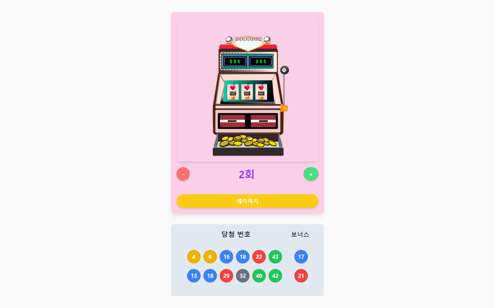

# Redux-Lotto

## 프로젝트 소개

이 웹사이트는 로또 번호를 랜덤으로 생성할 수 있는 웹 애플리케이션입니다.

사용자는 횟수를 설정하고, 버튼 클릭을 통해 랜덤으로 생성된 로또 번호를 확인할 수 있습니다.

당첨 번호와 보너스 번호를 시각적으로 예쁘게 보여줍니다.

## 데모 페이지

[DEMO](https://redux-lotto-gold.vercel.app/)

## 기능

- **로또 번호 생성 기능**: 사용자가 선택한 횟수만큼 랜덤으로 로또 번호를 생성합니다.
- **반응형 디자인**: 다양한 화면 크기에 맞춰 사용자 인터페이스가 자동으로 조정됩니다.

## 사용 기술

- **React**
- **Redux**
- **Tailwind CSS**
